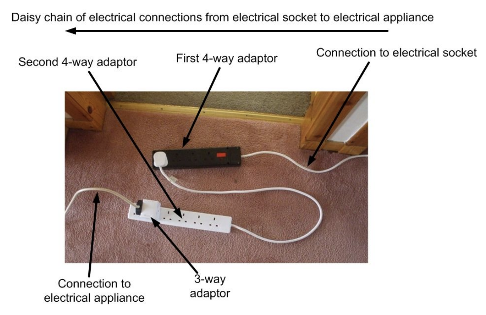

# Safety Guidelines

> This page is an adapted version from [Team 3637](https://www.team3637.com/safety/) until we design our own safety guidelines.

Safety is a major priority for our team. As a team, we always work to ensure our environment is safe and clean. In order to do so, we have put up signs to remind the team members to take proper safety measures and provided them with readily available safety equipment throughout the room.  Our safety program includes awareness of food allergies and specific measures to keep our build room and pit safe for anyone with a food allergy.

**Safety is our number 1 priority.** Robotics does not happen if people get injured.

- Be aware of your surroundings
- Ask questions when you aren’t sure of something
- Wear safety glasses in the manufacturing room, when working on or around robot, in the pit, or anywhere else posted.
- Report dangerous conditions to the Safety Captain or mentor
- Know, respect, and act upon safety rules
- **Help others be safe**

## Personal Safety

- **Be Patient!**
- Wear safety glasses when
  - Working in the manufacturing room
  - In the pits at competition
  - Are around the robot in general
  - Wherever posted
- Tie back long hair to ensure it does not get caught
- Wear closed toe shoes that cover your heel and entire top of your foot
- No jackets with hoods or strings, long sleeves must be rolled back
- Remove any dangling jewelry
- No horseplay or fooling around near the robot or in the manufacturing room
- Ensure there is a mentor present when working with power tools
- Lift with legs not your back - 50yr old you will thank you for this!
- Wear gloves when working with
  - sharp tools such as saws, knives, and certain types of drills
  - sharp materials or things that could splinter, such as shaving, sanding, or cutting

## Build Room Safety

- **Be aware of your surroundings**
- Let the machines fully stop before cleaning, measuring, adjusting, or leaving the machine.
- Pay complete attention to your work
  - Do not distract people who are working on machines
  - Do not rush

## Hand Tool Safety

- Check to see if hand tools are in good condition
  - Check for broken handles
  - No chips in tool
- Only work on a hard surface, do not use your hand as a surface
- **Use the right tool for the right job**
- Safely give tools to other people, do not face sharp edges toward yourself or others
- Make sure you can see the object you are working on
- Put tool back where you found it

### Drill Bits & Taps

- Do not touch broken or damaged taps and bits
- If used under power, always use tap with appropriate counterbore
- Do not drill with excessive force
- Make sure the piece you are going to drill is clear of other objects (i.e. wires, fingers, unneeded pieces of plastic)
- Adjust drilling speed to the job being done
- If drilling/tapping over electronics, please place a plastic bag over them to prevent any shorting in the case of shavings

### Screwdrivers

- Do not hold piece you are working on in your hand, keep on flat, hard surface
- Never use hammer in place of a chisel
- Use the proper screwdriver for the type of screw
  - e.g. phillips head screwdriver for phillips head screw
- Keep tip of screwdriver clean
- Only use properly insulated screwdrivers when doing electrical work

### Hammers

- Never use hammers that have unsturdy, loose handles
- Do not use hammers with chips or cracks
- Strike with a square blow, parallel to surface being struck
- Handles should be insulated and cushioned

### Wrenches

- Only use wrenches that fit properly
- Pull on wrench, do not push
- Turn adjustable wrench towards the permanent jaw
- Do not use wrench on moving machinery

### Files

- Check to see if handles are in good conditions
- File in one direction, away from you
- Always wear gloves when filing!

### Box Cutters & Knives

- Cut away from body and hands
- Always close box cutter before putting it down or away
- If you drop a cutting tool, do not try to catch it. Let it fall

### Hacksaw

- Use correct blade for job
- Be sure that work is securely fastened
- Do not use excessive pressure
- Make sure blade is secured within the frame

## Power Tool Safety

- Wear PPE and appropriate clothing
  - Do not wear gloves, watches, bracelets or any dangling jewelry
- Always use safety guards
- Give your undivided attention to the work you are doing
  - Do not distract others who are using power tools
- Fully let machine stop before measuring, adjusting or walking away from your work
- **Do not rush**
- Make sure you have good, solid footing when using machines
- In machines that require a chuck key, remove key before starting work
- Always get the help of a mentor while using the power tools
- Keep work area neat
- Keep fingers and other body parts at least 3 inches from the blade
  - Always be aware of where your fingers are placed
- Support all long materials
- Be careful of sharp edges on newly cut metal or wood
- Know how to stop the machine if there is an emergency
- Check machines and blades for damage
  - If you think something looks broken, or even slightly off, **ASK SOMEONE!!**
- Do not operate power tools if you feel sick, light-headed, or tired

### Band Saw

- Cuts wood and aluminium
- Check blade tension and tracking before turning on the machine
- The teeth of the blade should point down towards the table of the machine
- If the blade breaks during operation, immediately stop the saw, leave the stock where it is, unplug the saw, and report to a mentor or advisor

### Drill Press

- Make sure belt guards are in place
- Always clamp materials to the table
- Tighten chuck key and then remove before using
- Use the proper size drill bit for the job
- Make sure drill bit is secure in the chuck and in good condition
- When finished, turn off the power and remove drill bit

### Chop Saw

- Keep fingers clear of the path of the blade
- Regularly check and tighten the blade, inform someone if
you think something is wrong
  - Check to see if the blade/teeth are chipped, dull, broken, cracked or rusted.
- Clamp all material down
- After completing a cut, release the trigger switch and let the blade come to a complete stop, then raise the blade from the workpiece.
- Wear earplugs or earmuffs if possible; this is the loudest machine in the shop

### Bench Grinder

- Stand to one side when turning on
- Only grind materials on the face of the wheel, not the side
- Make sure the wheels are not too small or cracked, inform a mentor or an advisor if so
- Spark shields and tool rests should be adjusted to 1⁄8” from the wheels
- Small pieces of materials should should be held in place by Vice Grips
- Be careful, the wheels generate a lot of heat sometimes you will need to douse part in water after grinding
- Before leaving the machine, make sure the wheels have come to a complete stop
- Only grind steel

### Metal Lathe

- Be sure you have the proper lathe bit in before turning on the machine
  - Make sure bit and chuck are tight
- Do not remove or measure the piece before the lathe has come to a complete stop
- Take out chuck key before you turn on the machine
- Pay close attention to your work

## Electrical Safety

- Wear safety glasses whenever doing electrical work
- Makes sure cords and outlets are in good condition before and after every use.
- Always assume that a wire connected to the robot is powered. BE CAREFUL!
- When working on electrical cords or equipment, always check to see that no power is going to it.
  - ONLY WORK ON ELECTRICAL EQUIPMENT IF THERE IS NO POWER GOING TO IT
- Do not “daisy chain” power strips



### Solder Iron

- Always wear safety glasses
  - Solder iron can splatter
- Never leave a hot solder iron unattended.
- Unplug when not in use
- Do not touch the metal part of the solder iron
  - The solder iron can get up to 840 degrees fahrenheit
- Make sure the sponge is wet before every use
  - Wash excess solder off on sponge after every use
- Do not inhale fumes
  - Always keep head to the side of your work, not over it
- Always return the solder iron to its stand. Never place on your workbench.
- Always wash hands after use

### Battery

- Do not carry battery by the wires
  - Carry with two hands
- Only carry one battery at a time
- Do not unplug the battery from the robot unless the breaker is off

## In Case of Emergencies

### Battery Spill Cleanup

Follow the battery spill cleanup video below or [read the PDF courtesy of Team 3637](./Battery-Acid-Spill-Cleanup-Procedure.pdf).

```mdx-code-block
<YouTube youTubeId="II4AovjYV54" />
```