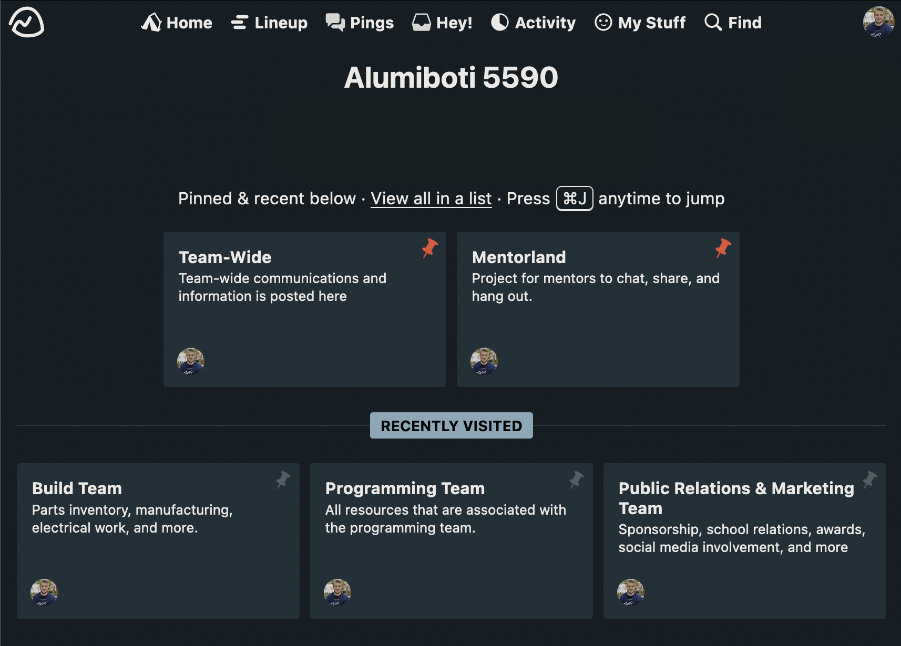
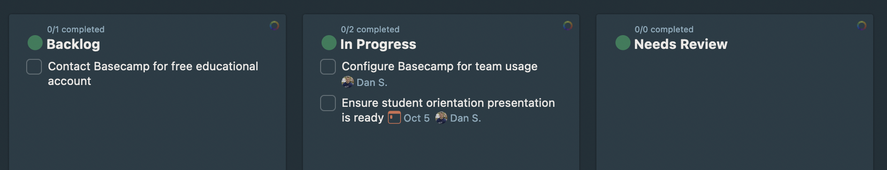

# Team Communications via Basecamp

In order to schedule events & tasks, organize into sub-teams, and communicate effectively, the Alumiboti uses [Basecamp](https://basecamp.com/). Basecamp is well vetted by other FIRST robotics teams and it includes many different tools and organization features to help us stay on top of our game.

## Getting Invited

Once you let a mentor know that you are interested in joining the team, they will invite you to Basecamp so you can start communicating with the team. At the beginning, you may only see the [Team-wide Project](https://3.basecamp.com/5447650/projects/29576039), but as you show interest and work with sub-teams more, you will end up seeing more projects for different aspects of the team.

After [logging into Basecamp](https://launchpad.37signals.com/signin) for the first time, it can be a bit daunting. The following information is designed to help get you up to speed as quickly as possible, so you can start communicating and contributing to the team.

## Projects

At the core of Basecamp are **Projects** - view our projects [here](https://3.basecamp.com/5447650/projects), or visit the Basecamp homepage.

Projects are top-level "buckets" that tasks, events, chat, and more get organized into. You can see a screenshot of the Basecamp homepage showing five different Projects below.

The team manages are few projects currently, which you see in the screenshot above:

### Team-Wide

The team-wide project is very important, since as the name implies, its where all resources for the team are stored. Anything that doesn't really fit a sub-team or that should be viewed by the entire team can go in this project. It's where our random banter and team chat can occur.

Finally, it is the project that will contain all of our meeting schedules and events, so please [subscribe to the Calendar](https://3.basecamp.com/5447650/buckets/29576039/schedules/5388250499/subscribe) so it shows up in your own Google Calendar.

### Mentorland

Mentorland is a project for mentors to discuss amongst each other and to track our own tasks. **Students should not have access to it.**

### Team-Based Projects

Finally, you should notice a few team-based projects; one for the [Build Team](https://3.basecamp.com/5447650/projects/29576152), [Programming Team](https://3.basecamp.com/5447650/projects/29576131), and [the Public Relations / Marketing Team](https://3.basecamp.com/5447650/projects/29576144).

This allows each team to have focused tasks, chat, and posted messages to keep up-to-date with the latest work.

More projects may be created over time as mentors and team leadership see fit.

## Project Tools

Each project comes with a subset of tools designed to help that associated project & its members run effectively. The following lists common tools that Basecamp projects come with.

To view these tools, click on a project from the example page shown above.

### Campfire (Chat)

**Campfire** is Basecamp's chat feature. Use it for quick back-n-forth conversations amongst multiple people when the conversation is not focused on one thing specifically for a long time.

### Message Board

The message board is designed to be a more persistent, focused way to communicate. It is a forum-/thread-based tool where new messages can be posted, and individuals can comment on the original message as needed. Used for focused conversations around particular topics or when something should be searchable later on.

### Schedule

The schedule is where events are posted. It's just the project calendar, nothing terribly special other than it helps us stay on time! ⏱ We recommend you [sync your personal calendar](https://3.basecamp-help.com/article/49-schedule#sync-your-schedule-with-an-external-calendar) to each project you are involved with, so Basecamp events show automatically.

### To-Dos (Tasks)

A project's To-Dos contain all of the tasks that need to be completed for that specific project. Each To-Do board has a set of **lists**, and each list can contain a set of tasks. The lists are helpful to organize cards based on their current completion status, such as the following lists:

- **Backlog** - These are tasks that need to get done, but that might not have any work completed or even an assigned individual yet
- **In Progress** - This list tracks any tasks that are currently being worked on, but that are not yet done
- **Needs Review** - These are tasks that may have the work completed, but that need to be reviewed first by another individual or mentor before considering the work _really_ done.

