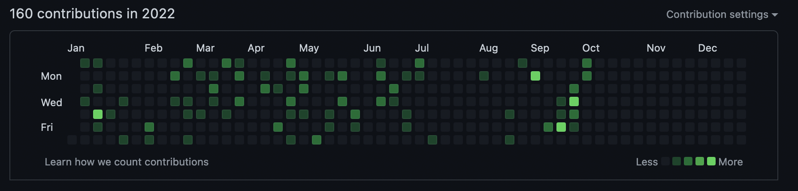

# GitHub

 is a `git`-compatible online service that provides hosting of [code repositories](./what-is-git#repository-as-a-timeline). We learned in the last section that `git` allows multiple people to have a copy
of a code project at one time, but who controls what _really_ should be there?

**GitHub acts as a central _source-of-truth_ for what code should exist everywhere.** While you may have code just on
your computer, anything on GitHub can be cloned (copied) by any member of the team.

## What's on Our GitHub?

The Alumiboti have a [GitHub Organization, `alumiboti5590`](https://github.com/alumiboti5590), where all of the team code is saved and managed. This is the home for our programming team and where most of their work will be saved to.

On the GitHub, we have

- The code for this website
- Robot code for the current and past years
- Some presentations for the team
- Old tutorials written for the team

Once you have a GitHub account configured - discussed in the next step - you will be able to walk through and view all of the team's code at your own leisure.

:::tip

The quality of the code and repositories is pretty wide spread, and certain parts may be difficult to understand, empty, or may not even work. Don't fret if something doesn't make sense, you'll figure it out eventually!

:::

## Procuring a GitHub Account

### Team Account

There is a team-wide Alumiboti account that can be used on shared computers and workstations while interacting with `git` and GitHub.

You can get the credentials for the account by following the [Team Credentials section](../../../resouces/credentials). After a usage or two, the shared account will probably already be set up on the lab computers as needed.

### Individual Account

If you have your own computer or are feeling adventerous, you can [create your own GitHub account](https://github.com/signup) which will allow you to create and push [commits](./what-is-git#a-git-commit) as yourself, instead of under the team account. If you think you might do some programming in the future outside of what the team does, it might be useful to create an account now so you can keep a history of all the neat stuff you are going to program in the future!

